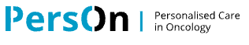
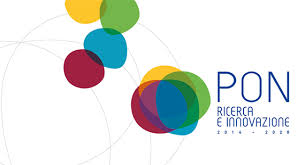
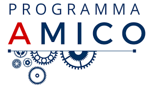

	

## Personalised  Care in Oncology

[PersOn](https://www.personalisedcareinoncology.nl/) (project number P21-03) of the research programme Perspectief 2021-2022 (TTW) financed by the Dutch Research Council (NWO), domain Applied and Engineering Sciences.

	

## ASMARA

[MIUR P.O.N. Smart Cities and Communities and Social Innovation](https://www.istruzione.it/archivio/web/ricerca/smart-cities-and-communities-and-social-innovation.html) has been partly funded by the project ASMARA – Appli- cazioni pilota post Direttiva 2010/65 in realta` portuali italiane della Suite MIELE a supporto delle Authority per ottimizzazione della inteRoperabilita` nell’intermodalitA’ dei flussi citta` porto – SCN 00529 – MIUR P.O.N. Smart Cities and Communities and Social Innovation

	

## AMICO

[AMICO - Medical Assistance in Contextual Awareness:](https://www.istruzione.it/archivio/web/ricerca/smart-cities-and-communities-and-social-innovation.html) project has received funding from the National Programs (PON) of the Italian Ministry of Education, Universities and
Research (MIUR): code ARS0100900 (Decreen.1989, 26 July 2018)