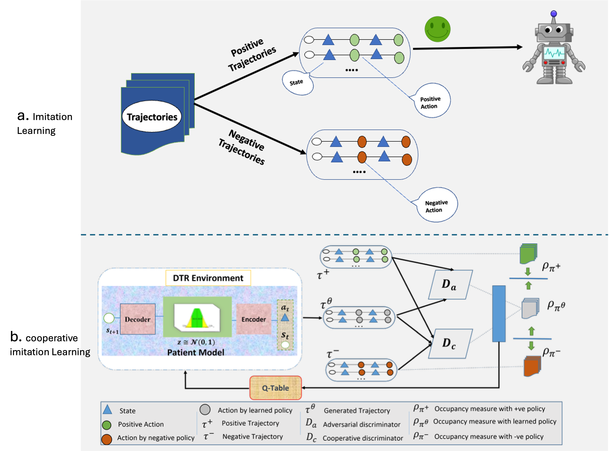
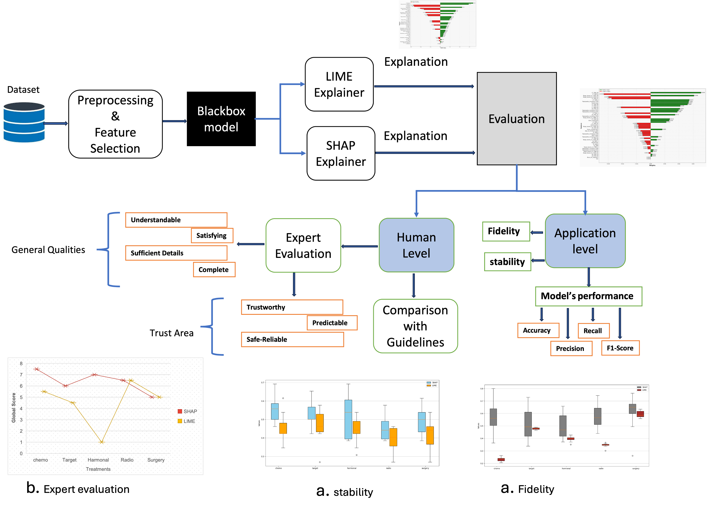
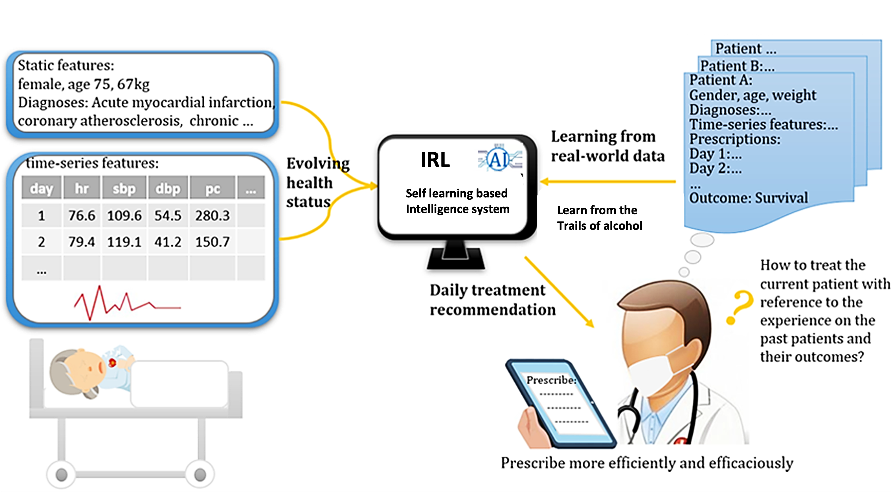
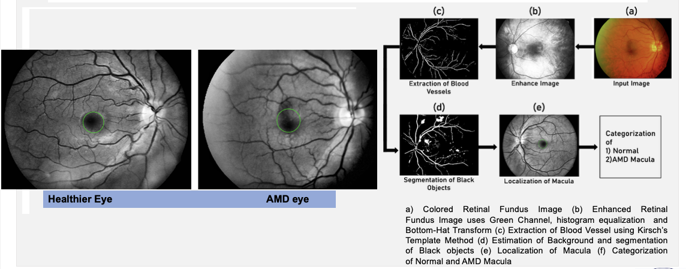
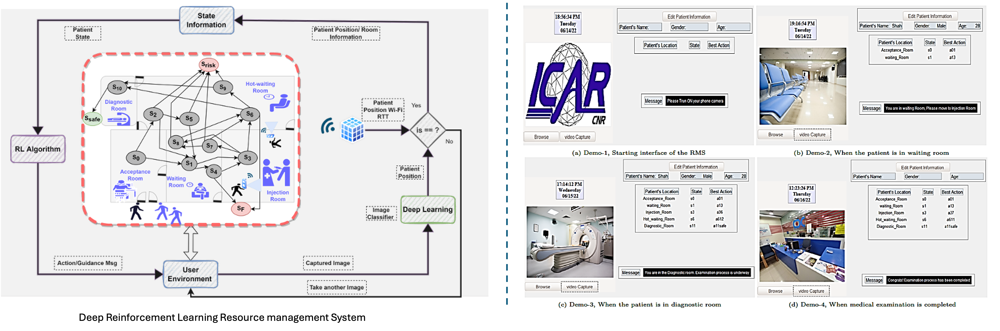

We investigate how to advance **responsible**, **explainable**, and **human-centered AI** to support high-stakes task e.g. healthcare decision-making.

My research combines machine learning, sequential decision-making, and clinical insight to design AI systems that are transparent, trustworthy, and aligned with both clinical practices and **patient preferences**. By integrating **explainability**, **preference-awareness**, and **clinical constraints**, my work aims to bridge the gap between state-of-the-art AI methods and real-world clinical impact.

<table style="border-collapse: collapse; border: none; table-layout: fixed ; width: 100%;">
<tr style="border: none;">
  <td style="text-align: center; border: none">
      
  </td>
  <td style="border: none">
      <b>Imitation Learning:</b> Traditonal Imitation Learning (IL) approaches rely only on positive trajectories (i.e., treatments that concluded with positive responses of the patient). In contrast, negative trajectories (i.e., samples of non-responding treatments) are discarded, although these have valuable information content. We propose a Cooperative Imitation Learning (CIL) method that exploits information from both negative and positive trajectories to learn the optimal DTR. The proposed method reduces the chance of selecting any treatment which results in a negative outcome (negative response of the patient) during the medical examination. To validate our approach, we have considered a well-known DTR which is defined for the treatment of patients with alcohol addiction. Results show that our approach outperforms those that rely only on positive trajectories. 
  </td>
</tr>
<tr style="border: none;">
  <td style="text-align: center; border: none">
      
  </td>
  <td style="border: none">
  <b>Explainable And Responsible AI:</b> Explainable AI (XAI) assists clinicians and researchers in understanding the rationale behind the predictions made by data-driven models which helps them to make informed decisions and trust the model's outputs. However, given the variety of explanation techniques, there is no universally applicable evaluation metric that can reliably assess the quality of all explanations. We addresses this gap by introducing a set of universal evaluation metrics designed to assess explanation performance across different techniques and contexts. We also inveitegate the other ways for explanability and working on safe sequential decision making. 
  </td>
</tr>
<tr style="border: none;">
  <td style="text-align: center; border: none">
      
  </td>
  <td style="border: none">
  <b>Inverse Reinforcement Learning:</b> Reinforcement Learning (RL) and Imitation learning paradigm may be limited by the need to design a true reward function, which may be difficult to formalize when the expert knowledge is not well assessed. To address this limitation, an extension of the RL paradigm, namely Inverse Reinforcement Learning (IRL), has been adopted to learn the reward function from data. We propose a Projection Based Inverse Reinforcement Learning (PB-IRL) approach to learn the true underlying reward function. Such a reward function can be used both to evaluate the set of Dynamic Treatment Regimes (DTRs) determined for a certain disease, as well as to enable an RL-based intelligent agent to self-learn the best way and then act as a decision support system for the clinician.
  </td>
  </tr>
<tr style="border: none;">
  <td style="text-align: center; border: none">
      
  </td>
  <td style="border: none">
  <b>Medical Image Processing:</b> We invertigate and analyse advance imaging techniques to extract the usefull information for better prediction prediction and decision making. In aged people, the central vision is affected by Aged-Related Macular Degeneration (AMD). In this research, we make safe, non-contact and cost-effective platform that can be used for the localization of the macula and monitoring system for dry AMD. 
  </td>
  </tr>
<tr style="border: none;">
  <td style="text-align: center; border: none">
      
  </td>
  <td style="border: none">
  <b>Uncertanity Quantification:</b> Conformal prediction (CP) is a powerful framework for quantifying uncertainty in machine learning models, offering reliable predictions with finite-sample coverage guarantees. When applied to classification, CP produces a prediction set of possible labels that is guaranteed to contain the true label with high probability, regardless of the underlying classifier. However, standard CP treats classes as flat and unstructured, ignoring domain knowledge such as semantic relationships or hierarchical structure among class labels. This paper presents hierarchical conformal classification (HCC), an extension of CP that incorporates class hierarchies into both the structure and semantics of prediction sets. We formulate HCC as a constrained optimization problem whose solutions yield prediction sets composed of nodes at different levels of the hierarchy, while maintaining coverage guarantees.
  </td>
  </tr>
<tr style="border: none;">
  <td style="text-align: center; border: none">
      
  </td>
  <td style="border: none">
  <b>AI for social good:</b> A medical examination at Nuclear Medicine Department (NMD) carries out at multiple stages. Patients are accompanied and guided by nurses during their movements within the NMD to avoid them entering into any hazardous situation. However, even accompanying nurses could be exposed to harmful radiation, which puts their safety at risk. Artificial Intelligence (AI) technologies can address these issues by supporting these processes avoiding risky situations, and preventing patients’ and clinicians’ safe. This article presents an artificial intelligence-based architecture for risk management during the nuclear medical examination to automatically guide the patients during the medical examination and support injury prevention. The architecture comprises two main components; the first component integrates Deep Learning (DL) techniques and WiFi tools to monitor and verify the patient’s position continuously; the second integrates Reinforcement Learning (RL) techniques to guide the patient during his/her examination.
  </td>
</tr>
</table>

See [my recent publications](https://www.ilievski.info/publications/) for more information.
